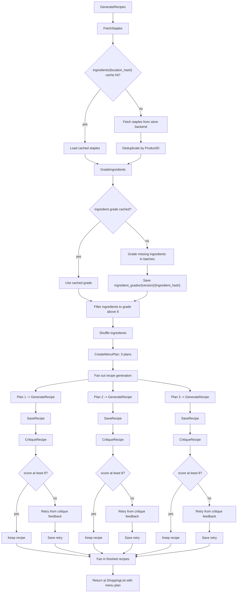

# Recipe Generation Walkthrough

This document covers the first-time generation path inside `generatorService.GenerateRecipes`, from fetching staples to fanning generated recipes back into an `ai.ShoppingList`.

For cache key details, see [cache-layout.md](cache-layout.md).

## Flow



## Staples And Grading

`FetchStaples` lives in `internal/recipes/staples.go`. It uses `GeneratorParams.LocationHash()` so the same store, date, and staples backend signature can reuse `ingredients/<location_hash>` even when user recipe instructions differ.

On a cache miss, the routed staples provider picks the store backend, fetches staple candidates, and dedupes them by `ProductID`. On both cache hits and misses, the result goes through `GradeIngredients`.

Ingredient grading uses the cache in `internal/ingredients/grading/cache.go`:

1. Keep ingredients that already have a grade.
2. Load cached grades from `ingredient_grades/<cache_version>/<ingredient_hash>`.
3. Send only missing ingredients to the underlying grader.
4. Cache returned grades.

Back in `GenerateRecipes`, ingredients with `Grade.Score <= 6` are removed. Ungraded ingredients are still allowed through.

## Menu Plan And Recipe Fan-Out

After grading, `GenerateRecipes` shuffles the ingredient list and calls `CreateMenuPlan` for exactly three plans. The menu plan request includes the location, filtered ingredients, user directive, user instructions, recipe date, and recently cooked recipe titles.

The returned `menuPlan.Plans` are processed with `parallelism.MapWithErrors`. Each plan becomes one worker:

- append the plan instructions to the base instructions
- call `GenerateRecipe`
- set `OriginHash`
- call `critiqueAndMaybeRetryRecipe`

## Critique And Fan-In

`critiqueAndMaybeRetryRecipe` saves the generated recipe first, then asks the critique service for feedback. If critiques are disabled, the rubberstamp service returns a passing score.

When a critique score is at least `critique.MinimumRecipeScore` (`8`), the recipe is kept. When the score is below `8`, the generator does a critique-driven retry with the original recipe response ID. The retry is saved, linked back with `ParentHash`, and used in place of the original recipe.

Once all workers finish, `GenerateRecipes` fans the recipe results back into:

```go
&ai.ShoppingList{
    Recipes: lo.FromSlicePtr(results),
    Plan:    menuPlan,
}
```
