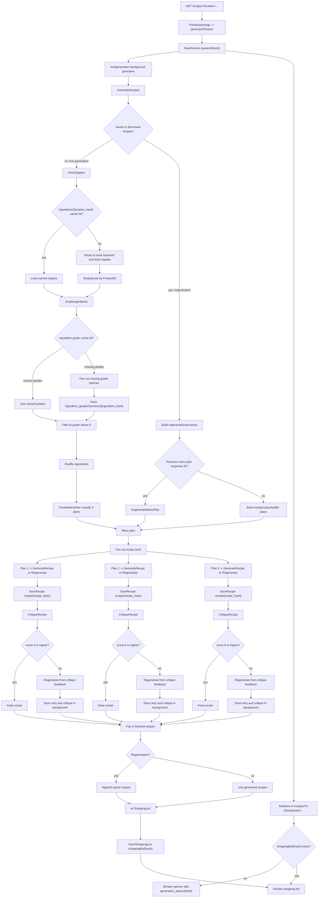

# Recipe Generation Walkthrough

This document traces the current recipe generation path from a user request through staples fetching, ingredient grading, menu planning, recipe generation, critique, and regeneration.

For cache key details, see [cache-layout.md](cache-layout.md). For the object lifecycle around params, selection state, and regeneration, see [data-object-flow.md](data-object-flow.md).

## High-Level Flow

Recipe generation starts in `internal/recipes/server.go` when a user requests `GET /recipes?location=...` without an `h` hash query parameter.

1. `handleRecipes` parses query args into `generatorParams`.
2. The params are saved under `params/<hash>`.
3. `kickgeneration` starts background work and redirects the user to `/recipes?h=<hash>&start=...`.
4. Until `shoppinglist/<hash>` exists, the page renders the spinner and reads progress from `generation_status/<hash>`.
5. Once generation finishes, `SaveShoppingList` stores the final list under `shoppinglist/<hash>`.

The generation itself lives in `internal/recipes/generator.go`:

1. Fetch and grade staples.
2. Filter weak ingredients.
3. Ask the AI client for a menu plan.
4. Fan out one recipe generation request per menu plan item.
5. Save, critique, and optionally retry each recipe.
6. Fan the finished recipes back into an `ai.ShoppingList`.

## Fan-Out And Fan-In

## Staples Fetching

Staples fetching is handled by `cachedStaplesService.FetchStaples` in `internal/recipes/staples.go`.

The service computes a location hash from location ID, recipe date, and the active staples backend signature. That hash is separate from the full recipe hash, so different user instructions can reuse the same store/date staples.

On a cache hit, the service loads `ingredients/<location_hash>` and still runs ingredient grading. On a cache miss, the routed staples provider selects the backend by store ID, fetches the staple candidates, dedupes them by `ProductID`, grades them, and stores the graded staples under `ingredients/<location_hash>`.

Supported backend routing is defined by the identity providers in `defaultStaplesBackends`, currently covering Kroger-style IDs plus supported Whole Foods, Walmart, and Albertsons-family IDs.

## Ingredient Grading

Ingredient grading is wired in `cmd/careme/web.go` through `ingredientgrading.NewManager`, then passed into `NewCachedStaplesService`.

The caching grader in `internal/ingredients/grading/cache.go` works per ingredient:

1. If an ingredient already has a grade, use it.
2. Otherwise load `ingredient_grades/<cache_version>/<ingredient_hash>`.
3. Fan out any missing ingredients to the underlying grader in batches.
4. Save returned grades back to the grade cache.

`GenerateRecipes` then filters the ingredient list to keep ingredients with no grade or with `Grade.Score > 6`. That filtered list is shuffled before being passed to menu planning, so the model sees a strong but varied set of sale and staple candidates.

## Menu Planning And Recipe Generation

First-time generation calls `CreateMenuPlan` with:

- the selected location
- filtered and shuffled ingredients
- the user directive plus current instructions
- the recipe date
- recently cooked recipe titles
- a count of `3`

The AI client builds context messages with seasonality, timing defaults, cooking methods, ingredients as TSV, prior cooked recipes, and user instructions. It asks for exactly three distinct recipe plans, with one fancy plan and one less-common cuisine direction when generating three or more plans.

After the plan returns, `GenerateRecipes` fans out over `menuPlan.Plans` with `parallelism.MapWithErrors`. Each worker appends the plan instructions to the base instructions and calls `GenerateRecipe`.

Each generated recipe gets:

- `OriginHash` set to the current params hash
- an individual cache write through `SaveRecipe`
- a critique pass through `critiqueAndMaybeRetryRecipe`

When all workers finish, the recipe pointers are fanned back into a single `ai.ShoppingList` with the menu plan attached.

## Critiques And Automatic Retry

Critiques are managed by `internal/recipes/critique`. If Gemini critique configuration is disabled, the service rubberstamps recipes with a score of `10`. If enabled, it critiques recipes through `ai.CritiqueRecipe` and caches results under `recipe_critiques/<recipe_hash>`.

`critiqueAndMaybeRetryRecipe` blocks on the first critique for each recipe worker:

1. Save the generated recipe.
2. Write a status like `Getting feedback on: ...`.
3. Read the critique result.
4. Keep the recipe if the critique is missing, errors, or scores at least `critique.MinimumRecipeScore` (`8`).
5. If the score is below `8`, call `Regenerate` using critique retry instructions and the original recipe response ID.
6. Save the retry, set `ParentHash` to the original recipe hash, and critique the retry in the background.

The retry replaces the original recipe in the shopping list, but both recipes can exist in the individual recipe cache because they have different hashes.

## Regeneration

User regeneration starts at `POST /recipes/{hash}/regenerate`.

`handleRegenerate` loads the current user, reads form instructions, and calls `paramsForAction`. That function combines:

- original params from `params/<hash>`
- current list from `shoppinglist/<hash>`
- saved and dismissed recipe selection from `recipe_selection/<user_id>/<origin_hash>`
- the prior menu plan response ID from the current shopping list, when available

If the user has not explicitly dismissed anything, regeneration treats every unsaved recipe as dismissed. That gives the generator a concrete replacement count.

In `GenerateRecipes`, regeneration skips staples fetching and recipe creation from scratch. It builds `regenerateInstructions` from the new user instructions, newly saved recipe titles, and passed-on recipe titles. Then it asks for replacement menu plans:

- `RegenerateMenuPlan` when `PreviousMenuPlanResponseID` is available
- back-compat placeholder plans when older cached lists do not have a menu plan response ID

The replacement plans fan out in parallel. Each worker calls `Regenerate` against the dismissed recipe response ID, critiques and retries the result if needed, then returns the replacement recipe. Finally, the replacements fan back in and saved recipes are appended to build the regenerated `ai.ShoppingList`.
