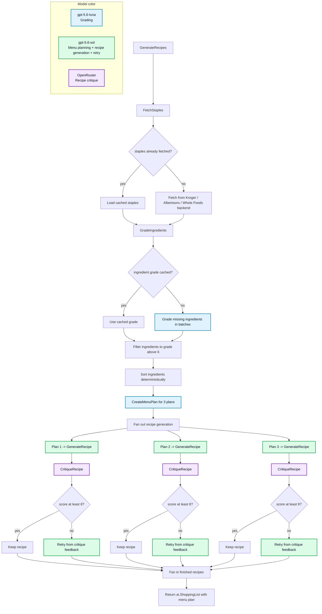

# Recipe Generation Walkthrough

This document covers the first-time generation path inside `generatorService.GenerateRecipes`, from fetching staples to fanning generated recipes back into an `ai.ShoppingList`.

## Flow


```mermaid
flowchart TD
    subgraph Legend["Model color"]
        MiniLegend["gpt-5.6-luna<br/>Grading"]
        GPT5Legend["gpt-5.6-sol<br/>Menu planning + recipe generation + retry"]
        OpenRouterLegend["OpenRouter<br/>Recipe critique"]
    end

    A["GenerateRecipes"] --> B["FetchStaples"]
    B --> C{"staples already fetched?"}
    C -- "yes" --> D["Load cached staples"]
    C -- "no" --> E["Fetch from Kroger / Albertsons / Whole Foods backend"]
    E --> G["GradeIngredients"]
    D --> G

    G --> H{"ingredient grade cached?"}
    H -- "yes" --> I["Use cached grade"]
    H -- "no" --> J["Grade missing ingredients in batches"]
    I --> L["Filter ingredients to grade above 6"]
    J --> L

    L --> M["Sort ingredients deterministically"]
    M --> N["CreateMenuPlan for 3 plans"]
    N --> O["Fan out recipe generation"]

    O --> P1["Plan 1 -> GenerateRecipe"]
    O --> P2["Plan 2 -> GenerateRecipe"]
    O --> P3["Plan 3 -> GenerateRecipe"]

    P1 --> R1["CritiqueRecipe"]
    P2 --> R2["CritiqueRecipe"]
    P3 --> R3["CritiqueRecipe"]

    R1 --> S1{"score at least 8?"}
    R2 --> S2{"score at least 8?"}
    R3 --> S3{"score at least 8?"}

    S1 -- "yes" --> T1["Keep recipe"]
    S2 -- "yes" --> T2["Keep recipe"]
    S3 -- "yes" --> T3["Keep recipe"]

    S1 -- "no" --> U1["Retry from critique feedback"]
    S2 -- "no" --> U2["Retry from critique feedback"]
    S3 -- "no" --> U3["Retry from critique feedback"]

    T1 --> W["Fan in finished recipes"]
    T2 --> W
    T3 --> W
    U1 --> W
    U2 --> W
    U3 --> W

    W --> X["Return ai.ShoppingList with menu plan"]

    classDef mini fill:#e0f2fe,stroke:#0284c7,color:#0f172a,stroke-width:2px
    classDef gpt5 fill:#dcfce7,stroke:#16a34a,color:#0f172a,stroke-width:2px
    classDef openrouter fill:#f3e8ff,stroke:#7e22ce,color:#0f172a,stroke-width:2px

    class MiniLegend,J,N mini
    class GPT5Legend,P1,P2,P3,U1,U2,U3 gpt5
    class OpenRouterLegend,R1,R2,R3 openrouter
```

## Staples And Grading

`FetchStaples` lives in `internal/recipes/staples.go`. It can reuse staples for the same store, date, and staples backend signature even when user recipe instructions differ.

On a cache miss, the routed staples provider picks the store backend and fetches staple candidates. The backend can be Kroger, Albertsons-family, or Whole Foods depending on the selected store. On both cache hits and misses, the result goes through `GradeIngredients`.

Ingredient grading uses the cache in `internal/ingredients/grading/cache.go`:

1. Keep ingredients that already have a grade.
2. Reuse cached grades for known ingredients.
3. Send only missing ingredients to the underlying grader.

Back in `GenerateRecipes`, ingredients with `Grade.Score <= 6` are removed. Ungraded ingredients are still allowed through.

The model boundary in this section is ingredient grading. Fetching staples is store data retrieval; grading missing ingredients uses the configured ingredient grading model, defaulting to `gpt-5.6-luna`.

## Menu Plan And Recipe Fan-Out

After grading, `GenerateRecipes` sorts the ingredient list deterministically and calls the menu-planning model through `CreateMenuPlan` for exactly three plans. Deterministic ordering keeps the serialized ingredient TSV identical when its contents have not changed, which is required for prompt-cache prefix matches. The menu plan request includes the location, filtered ingredients, user directive, user instructions, recipe date, and recently cooked recipe titles. Menu planning uses `gpt-5.6-sol`.

The returned `menuPlan.Plans` are processed with `parallelism.MapWithErrors`. Each plan becomes one worker and makes its own `gpt-5.6-sol` recipe model call:

- append the plan instructions to the base instructions
- call `GenerateRecipe`
- set `OriginHash`
- call `critiqueAndMaybeRetryRecipe`

## Recipe Prompt Caching

Recipe generation uses the Responses API with `store: true` and continues model state through `previous_response_id`. Conversation state and prompt caching are separate: the response ID selects the conversation history, while `prompt_cache_key` helps route requests to the cache containing an exact prompt prefix.

The initial menu-plan request has two explicit GPT-5.6 cache breakpoints:

1. Immediately after the ingredient TSV. This preserves the large ingredient prefix when later menu instructions differ.
2. At the end of the complete initial menu-plan prompt. Descendant recipe calls can reuse the longest matching initial-menu prefix.

Menu regeneration requests add no new breakpoint markers. Breakpoints inherited through the response chain remain available for reads, while the changing regeneration suffix is not written as another cache entry. Requests use `prompt_cache_options.mode: "explicit"` so GPT-5.6 does not also place an implicit breakpoint after the changing final message.

The prompt cache key hashes the store ID and store-local sale date. Users generating from the same ingredient set can therefore share the ingredient breakpoint. The complete-menu breakpoint remains isolated by exact prefix matching: it is reused only when all content through that breakpoint also matches. Generated recipes retain the hashed key as server-owned metadata so later questions and rewrites can use the same cache namespace in a separate HTTP request. Older recipes without this metadata fall back to a hash of Careme user and session identity.

These request controls are specific to direct OpenAI GPT-5.6 and later models. Stable prefix ordering is portable, but OpenRouter and other providers use different controls, including provider-specific `cache_control` blocks and sticky `session_id` routing. Introduce a provider/model-specific cache policy before routing recipe requests through another provider or an incompatible model. See the [OpenAI prompt cache key guidance](https://developers.openai.com/api/docs/guides/prompt-caching#improve-cache-hit-rates-with-a-prompt-cache-key).

Usage logs expose both `usage_inputTokensDetails_cachedTokens` and `usage_inputTokensDetails_cacheWriteTokens`. The first request for a prefix should generally report a cache write; later requests in the same response chain should report cached-token reads. A zero read is expected when the exact prefix changed or no prior write is available.

## Critique And Fan-In

`critiqueAndMaybeRetryRecipe` asks the OpenRouter critique model for feedback. The model is selected with `OPENROUTER_CRITIQUE_MODEL` and defaults to `google/gemini-3.1-pro-preview`. If critiques are disabled, the rubberstamp service returns a passing score without a model call.

When a critique score is at least `critique.MinimumRecipeScore` (`8`), the recipe is kept. When the score is below `8`, the generator does one more `gpt-5.6-sol` recipe model call using the critique feedback and original recipe response ID, then uses that retry in place of the original recipe.

Once all workers finish, `GenerateRecipes` fans the recipe results back into:

```go
&ai.ShoppingList{
    Recipes: lo.FromSlicePtr(results),
    Plan:    menuPlan,
}
```
