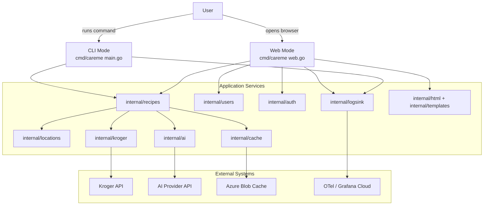

# Careme System Flow

```mermaid
flowchart TD
    U[User]
    CLI[CLI Mode\ncmd/careme main.go]
    WEB[Web Mode\ncmd/careme web.go]

    subgraph APP[Application Services]
      REC[internal/recipes]
      LOC[internal/locations]
      KRO[internal/kroger]
      AI[internal/ai]
      CACHE[internal/cache]
      USERS[internal/users]
      AUTH[internal/auth]
      LOGS[internal/logsink]
      HTML[internal/html + internal/templates]
    end

    subgraph EXT[External Systems]
      KAPI[Kroger API]
      AIP[AI Provider API]
      BLOB[Azure Blob Cache]
      O11Y[OTel / Grafana Cloud]
    end

    U -->|runs command| CLI
    U -->|opens browser| WEB

    CLI --> REC
    WEB --> AUTH
    WEB --> USERS
    WEB --> HTML
    WEB --> REC

    REC --> LOC
    REC --> KRO
    REC --> AI
    REC --> CACHE

    KRO --> KAPI
    AI --> AIP
    CACHE --> BLOB
    WEB --> LOGS
    CLI --> LOGS
    LOGS --> O11Y
```

This diagram summarizes how users enter the app through CLI or web mode and how core services interact with internal modules and external providers.
